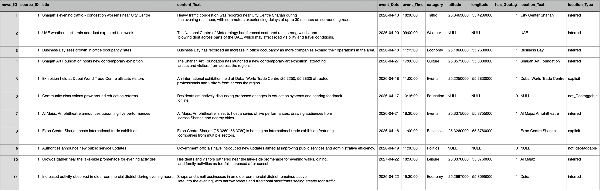
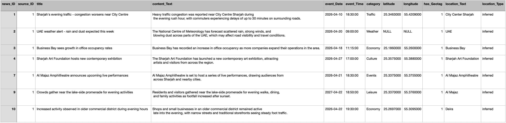
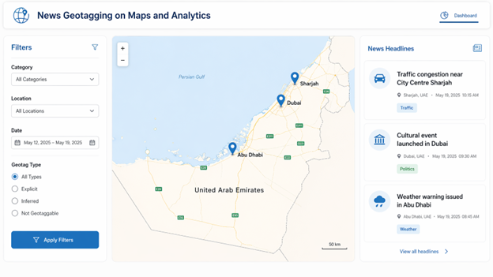
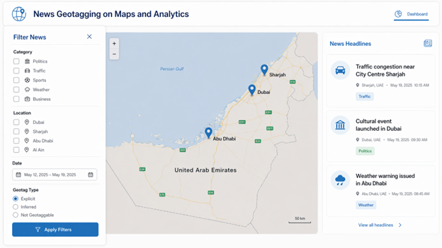
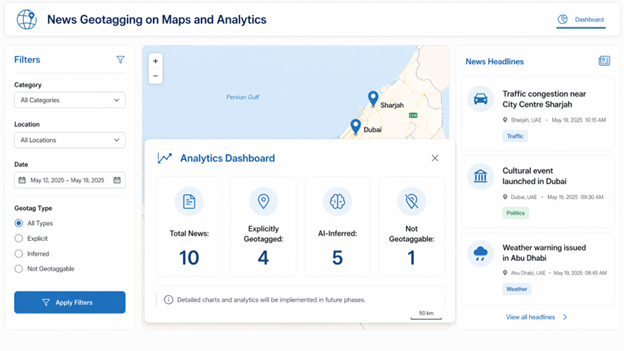
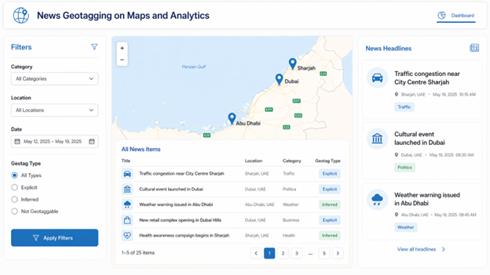

# NewScape: Geotagging News System

## Overview

NewsScape is a map-based news visualization system designed to help users explore and analyze news geographically. Instead of viewing news as traditional headlines, the system displays news items on an interactive map using geographic markers, allowing users to understand where events are happening and explore trends through location-based analytics.

---

## Features

- Interactive map with geotagged news markers
- News filtering by category, date range, location, and geotag type
- News detail view for selected markers
- Dashboard analytics for trend exploration
- Location inference workflow using NLP techniques
- Classification of news into explicit, inferred, and non-geotaggable news

---

## Technologies & Concepts

- Data Analytics
- NLP (Natural Language Processing)
- Named Entity Recognition (NER)
- Geocoding
- Database Design
- System Architecture
- UI/UX Design
- Figma

---

## Database Preview

### NewsItem Table



### Sample Query Result



---

## Prototype

Interactive Figma Prototype: [View Prototype](https://www.figma.com/make/QB6RsbUsXGBvGe8AB3sAZ4/News-Geotagging-System-Prototype--Copy---Copy-?t=5aw3aAfLLTtykA7G-1)

Interactive Prototype Screens and Demo Files are available in the `prototype` folder.
Static Prototype Screens are available in the `pictures` folder.

---

## Screenshots

### Interactive News Map



### News Filtering Interface



### Dashboard Analytics



### News Details Panel



--

## Project Structure

```text
diagrams/       → System diagrams and workflows
pictures/       → Dashboard and interface screenshots
prototype/      → Interactive prototype screens and demo files
database/       → SQL schema and database scripts
source-code/    → Implementation files ( frontend / backend )
```

## My Contribution

This was a collaborative university project.

My contributions included:

- System architecture planning
- Location inference workflow design support
- Database design + testing
- Project documentation support

---

## Note

This repository contains project artifacts intended for portfolio and demonstration purposes ONLY.

University reports, partner documentation, and private project material have been excluded for privacy and confidentiality reasons.
